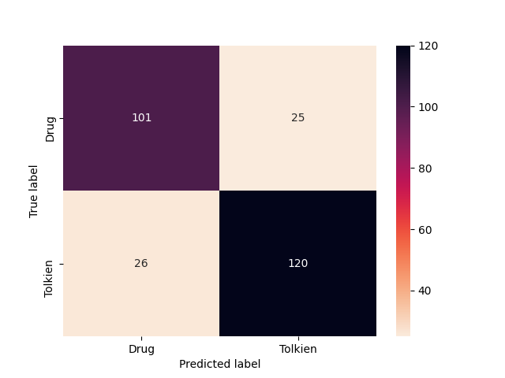

# Tolkien character or prescription drug name?
>Classification using character-level Long Short-Term Memory (LSTM) neural networks


## Summary

Bilbo, Silenor, Avandaryl, Nardil, Cymbalta. Only one of those is actually a Tolkien character. Could we solve this problem using artificial neural networks?
You can read more about it in [my blog post](https://gbnegrini.com/post/tolkien-character-prescription-keras-lstm-neural-networks/).

### Results

              precision    recall  f1-score   support

        Drug       0.80      0.80      0.80       126
     Tolkien       0.83      0.82      0.82       146

    accuracy                           0.81       272
    macro avg      0.81      0.81      0.81       272
    weighted avg   0.81      0.81      0.81       272





## Setup and how to use
All code is written in Python 3 and dependencies are listed in the [requirements file](requirements.txt).

An interactive Docker container can be launched using the [Dockerfile](Dockerfile):

```bash
docker build . -t tolkien
docker run -p 8888:8888 --name tk -v $(pwd):/tolkien-char-prescription-drug -it tolkien bash
```

The Jupyter notebook [report file](report.ipynb) contains the step-by-step code and analysis. You can also quickly run all steps using the script version:

```bash
python3 main.py
```

## References

>Hu, Y., Hu, C., Tran, T., Kasturi, T., Joseph, E., & Gillingham, M. (2021). [What's in a Name?--Gender Classification of Names with Character Based Machine Learning Models.](https://arxiv.org/pdf/2102.03692.pdf) arXiv preprint arXiv:2102.03692.

>Bhagvati, C. (2018). [Word representations for gender classification using deep learning.](https://www.sciencedirect.com/science/article/pii/S1877050918307476) Procedia computer science, 132, 614-622.

>Liang, X. (2018). [How to Preprocess Character Level Text with Keras.](https://towardsdatascience.com/how-to-preprocess-character-level-text-with-keras-349065121089)
